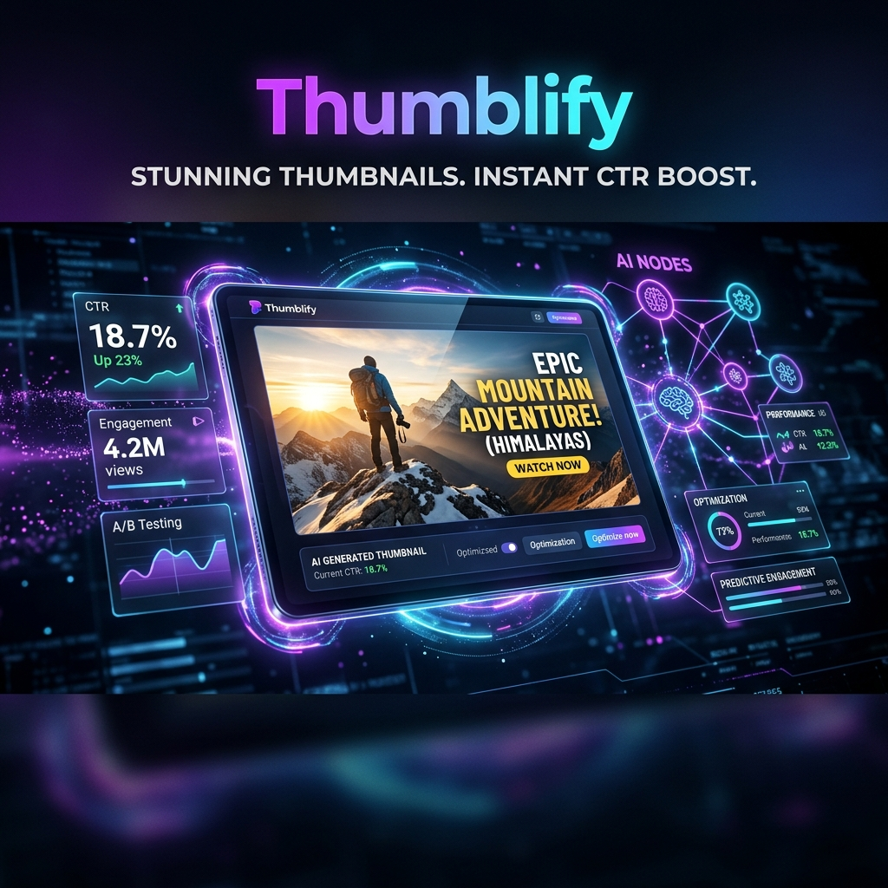
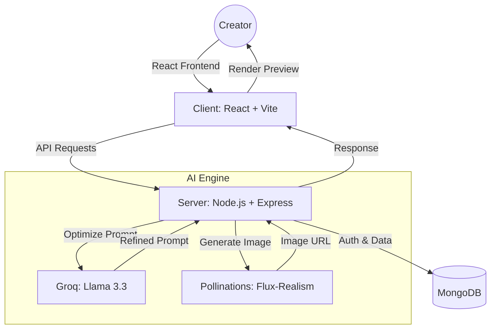

# 🚀 Thumblify - AI-Powered Thumbnail Generator



Thumblify is a premium SaaS platform designed for content creators to engineer clicks. Using advanced neural networks (Groq & Flux), it transforms simple topics into high-CTR, photorealistic thumbnails that demand attention.

## ✨ Features

- **🎯 Smart Prompt Optimization**: Uses Llama 3.3 (via Groq) to turn basic ideas into elite-tier image prompts.
- **📸 Photorealistic Generation**: Powered by the Flux-Realism model for studio-quality visuals.
- **📐 Multi-Format Support**: Generate thumbnails for 16:9 (YouTube), 1:1 (Instagram), 9:16 (Shorts/Reels), and 4:5 (Portrait).
- **🎨 Custom Styles & Palettes**: Choose from specific visual styles like Cinematic, Finance, Gaming, and more.
- **🔄 Intelligent Recreate**: Modify existing thumbnails or ideas with high-level change requests.
- **💳 Credit System**: Built-in SaaS credit management for controlled generation.
- **💎 Premium UI**: A glassmorphic, dark-themed dashboard with smooth Framer Motion animations.

## 🏗️ Architecture

Thumblify follows a modern MERN-stack architecture with AI service integration.



## 🖼️ Showcase


## 🛠️ Tech Stack

- **Frontend**: React.js, Tailwind CSS, Framer Motion, Lucide React, Axios.
- **Backend**: Node.js, Express.js, JWT.
- **Database**: MongoDB (Mongoose).
- **AI Integration**: Groq SDK, Pollinations.ai API.

## 🚀 Getting Started

### Prerequisites

- Node.js (v18+)
- MongoDB Atlas account
- Groq API Key

### Installation

1. **Clone the repository**
   ```bash
   git clone https://github.com/yourusername/thumblify.git
   cd thumblify
   ```

2. **Setup Backend**
   ```bash
   cd server
   npm install
   # Create .env file based on .env.example
   npm run dev
   ```

3. **Setup Frontend**
   ```bash
   cd ../client
   npm install
   # Create .env file with VITE_API_URL
   npm run dev
   ```

## 📄 License

This project is licensed under the MIT License - see the LICENSE file for details.

---

Built with ❤️ by the Thumblify Team.
